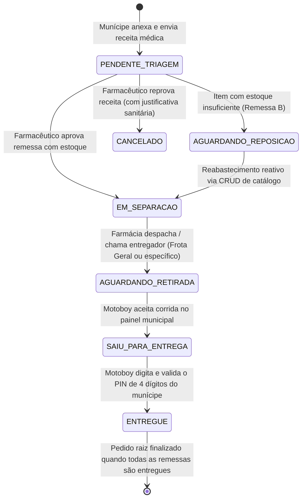

# 📦 Especificação 02: Modelos de Dados e Motor de Desmembramento (Order Splitting 1:N)

## 1. Visão Geral da Regra de Negócio

No serviço público de saúde de Indaiatuba, é comum que uma receita médica contenha múltiplos medicamentos (ex: Losartana 50mg e Dipirona 500mg disponíveis no estoque imediato, mas Amoxicilina 500mg temporariamente em falta na unidade).

No modelo tradicional burocrático, o pedido todo ficaria travado ou o paciente precisaria retornar presencialmente. No **Minha Farmácia**, introduzimos o **Desmembramento Inteligente de Pedidos (Order Splitting 1:N)**:
1. O pedido original (`Order`) se ramifica em dois ou mais subpedidos (`SubOrder`).
2. Os medicamentos disponíveis no estoque da Farmácia Central são agrupados no **SubOrder-A**, que segue imediatamente para separação e entrega.
3. Os medicamentos em falta são agrupados no **SubOrder-B**, com status `"AGUARDANDO_REPOSICAO"`, gerando uma solicitação automática de reabastecimento logístico.
4. Cada `SubOrder` possui seu próprio ciclo de vida, rastreamento independente, entregador atribuído e **código PIN de validação único de 4 dígitos**.

---

## 2. Modelos de Entidades (TypeScript / Schema)

```typescript
// Status de Pedido Geral e SubPedidos
export type OrderStatus =
  | 'PENDENTE_TRIAGEM'
  | 'EM_PROCESSAMENTO'
  | 'FINALIZADO'
  | 'CANCELADO';

export type SubOrderStatus = 
  | 'EM_SEPARACAO'          // Farmacêutico aprovou e os itens estão em separação física
  | 'AGUARDANDO_RETIRADA'   // Farmácia concluiu separação e despachou na Central, aguardando coleta
  | 'AGUARDANDO_COLETA'     // Compatibilidade/alias para aguardando retirada
  | 'SAIU_PARA_ENTREGA'     // Entregador aceitou a corrida e está em rota até a residência
  | 'AGUARDANDO_REPOSICAO'  // Medicamento em falta aguardando novo lote municipal
  | 'ENTREGUE'              // Entregue e confirmado com PIN
  | 'CANCELADO';            // Cancelado por inviabilidade técnica

// Unidades Básicas de Saúde (UBSs) de Indaiatuba
export type UBSUnit =
  | 'Farmácia Central'
  | 'UBS Morada do Sol'
  | 'UBS Itaici'
  | 'UBS Cecap'
  | 'UBS Parque Corolla';

export const INDAIATUBA_UBS_UNITS: UBSUnit[] = [
  'Farmácia Central',
  'UBS Morada do Sol',
  'UBS Itaici',
  'UBS Cecap',
  'UBS Parque Corolla'
];

// Munícipe / Cidadão
export interface CitizenAddress {
  street: string;
  number: string;
  neighborhood: string;
  city: string; // "Indaiatuba - SP"
  cep: string;
  lat: number;
  lng: number;
  complement?: string;
}

export interface Citizen {
  id: string;
  name: string;
  cpf: string;
  cartaoSus: string;
  phone: string;
  address: CitizenAddress;
}

// Medicamento do Catálogo Municipal e Estoque Distribuído
export interface Medication {
  id: string;
  name: string;
  dosage: string;
  presentation: string; // Ex: "Comprimido", "Frasco 100ml"
  stockQuantity: number;
  minStockAlert: number;
  active: boolean;
  category: 'BASICO' | 'CONTROLADO' | 'CONTINUO' | 'ANTIBIOTICO';
  estoquePorUnidade?: Record<UBSUnit, number>; // Saldo distribuído pelas 5 UBSs de Indaiatuba
}

// Item dentro do pedido
export interface OrderItem {
  medicationId: string;
  medicationName: string;
  dosage: string;
  quantityRequested: number;
  quantityApproved: number;
  isAvailable: boolean;
}

// SubPedido (Nó de Entrega / Desmembramento)
export interface SubOrder {
  id: string;
  orderId: string;
  code: string;               // Ex: "PED-2026-01-A", "PED-2026-01-B"
  label: string;              // Ex: "Remessa Imediata (Estoque Disponível)" vs "Remessa Reposição"
  items: OrderItem[];
  status: SubOrderStatus;
  pinCode: string;            // Código numérico de 4 dígitos para entrega (Ex: "4921")
  courierId?: string;         // ID do motoboy responsável
  courierName?: string;
  createdAt: string;
  updatedAt: string;
  estimatedDelivery?: string;
  deliveredAt?: string;
  notes?: string;
}

// Pedido Raiz (Solicitação do Munícipe)
export interface Order {
  id: string;
  code: string;               // Ex: "PED-2026-01"
  citizenId: string;
  citizenName: string;
  citizenCpf: string;
  citizenPhone: string;
  deliveryAddress: CitizenAddress;
  prescriptionImageUrl: string;
  status: OrderStatus;
  isSplit: boolean;           // Indica se o pedido foi desmembrado em 1:N
  splitReason?: string;
  subOrders: SubOrder[];
  createdAt: string;
  reviewedByPharmacistId?: string;
  reviewedAt?: string;
}

// Entregador Municipal
export interface Courier {
  id: string;
  name: string;
  vehicle: 'MOTO' | 'BICICLETA_ELETRICA' | 'CARRO';
  plate: string;
  phone: string;
  active: boolean;
  status?: 'DISPONIVEL' | 'EM_ROTA' | 'OFFLINE';
  currentLocation: {
    lat: number;
    lng: number;
    updatedAt: string;
  };
}
```

---

## 3. Gestão de Estoque Distribuído pelas 5 UBSs de Indaiatuba

O sistema monitora o inventário central e descentralizado nas unidades polos do município:
1. **Farmácia Central Municipal** (Ponto central de fracionamento e despacho)
2. **UBS Morada do Sol** (Zona Sul — alta densidade populacional)
3. **UBS Itaici** (Zona Leste — região campestre/rural)
4. **UBS Cecap** (Zona Norte — área residencial)
5. **UBS Parque Corolla** (Zona Noroeste)

### 3.1 Detecção de Ruptura de Estoque
- Sempre que uma UBS ou o total do município atingir `saldo <= 0`, o sistema classifica o item como em **Ruptura**.
- O Dashboard do Farmacêutico exibe o painel de alerta de ruptura com identificação exata de quais unidades estão zeradas para acionamento do remanejamento logístico entre postos antes da solicitação de novos lotes.

---

## 4. Algoritmo do Motor de Desmembramento (`splitEngine`)

```typescript
export interface SplitResult {
  isSplit: boolean;
  subOrders: SubOrder[];
  stockDeductions: { medicationId: string; quantity: number }[];
}

export function evaluateAndSplitOrder(
  order: Order,
  triageDecisions: { medicationId: string; approvedQty: number }[],
  currentCatalog: Medication[]
): SplitResult {
  const availableItems: OrderItem[] = [];
  const awaitingRestockItems: OrderItem[] = [];
  const stockDeductions: { medicationId: string; quantity: number }[] = [];

  for (const decision of triageDecisions) {
    const med = currentCatalog.find(m => m.id === decision.medicationId);
    if (!med || decision.approvedQty <= 0) continue;

    const availableQty = Math.min(med.stockQuantity, decision.approvedQty);
    const deficitQty = decision.approvedQty - availableQty;

    if (availableQty > 0) {
      availableItems.push({
        medicationId: med.id,
        medicationName: med.name,
        dosage: med.dosage,
        quantityRequested: decision.approvedQty,
        quantityApproved: availableQty,
        isAvailable: true
      });
      stockDeductions.push({ medicationId: med.id, quantity: availableQty });
    }

    if (deficitQty > 0) {
      awaitingRestockItems.push({
        medicationId: med.id,
        medicationName: med.name,
        dosage: med.dosage,
        quantityRequested: decision.approvedQty,
        quantityApproved: deficitQty,
        isAvailable: false
      });
    }
  }

  const subOrders: SubOrder[] = [];
  const isSplit = availableItems.length > 0 && awaitingRestockItems.length > 0;

  // Remessa A: Itens Disponíveis Imediatamente
  if (availableItems.length > 0) {
    subOrders.push({
      id: `${order.id}-A`,
      orderId: order.id,
      code: isSplit ? `${order.code}-A` : order.code,
      label: isSplit ? 'Remessa Imediata (Estoque Disponível)' : 'Entrega Padrão',
      items: availableItems,
      status: 'EM_SEPARACAO',
      pinCode: generateSecurePin(),
      createdAt: new Date().toISOString(),
      updatedAt: new Date().toISOString()
    });
  }

  // Remessa B: Itens Aguardando Reposição na Unidade Municipal
  if (awaitingRestockItems.length > 0) {
    subOrders.push({
      id: `${order.id}-B`,
      orderId: order.id,
      code: `${order.code}-B`,
      label: 'Remessa Reposição (Aguardando Novo Lote)',
      items: awaitingRestockItems,
      status: 'AGUARDANDO_REPOSICAO',
      pinCode: generateSecurePin(),
      createdAt: new Date().toISOString(),
      updatedAt: new Date().toISOString(),
      notes: 'Medicamento em reabastecimento logístico junto à Farmácia Central.'
    });
  }

  return { isSplit, subOrders, stockDeductions };
}

function generateSecurePin(): string {
  return Math.floor(1000 + Math.random() * 9000).toString();
}
```

---

## 5. Máquina de Estados e Ciclo de Vida da Entrega



---

## 6. Regras do Fluxo de Despacho e Conclusão com PIN

1. **Despacho pela Farmácia (`EM_SEPARACAO` ➔ `AGUARDANDO_RETIRADA`):** O farmacêutico seleciona se o pacote vai para a Frota Geral ou é atribuído nominalmente a um motoboy.
2. **Aceite pelo Entregador (`AGUARDANDO_RETIRADA` ➔ `SAIU_PARA_ENTREGA`):** O motoboy visualiza os pacotes prontos na central e aceita a rota ativa.
3. **Conclusão com PIN de 4 Dígitos (`SAIU_PARA_ENTREGA` ➔ `ENTREGUE`):** Validação estrita do PIN exclusivo do cidadão para baixa sanitária com fé pública.
