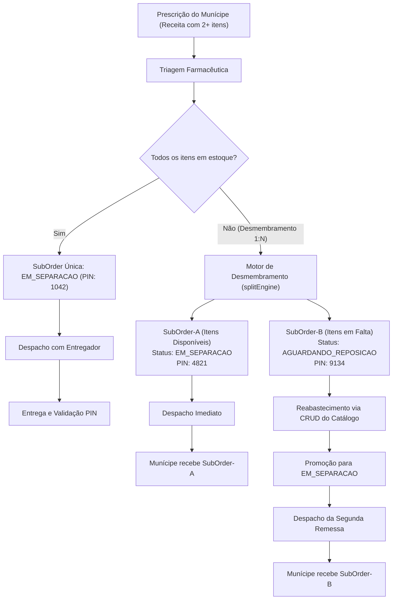

# 📋 Detalhamento Técnico — Minha Farmácia (Indaiatuba)

> **Solução Oficial de Entrega Municipal de Medicamentos**  
> **Hackathon Fatec Indaiatuba 2026** — Secretaria de Ciência, Tecnologia e Inovação / Secretaria Municipal de Saúde  
> **Padrão Visual:** Integrado à plataforma unificada [Minha Indaiatuba](https://minha.indaiatuba.sp.gov.br/)

---

## 1. Visão Geral e Proposta de Valor

O **Minha Farmácia** elimina as filas e a burocracia na obtenção de medicamentos da rede pública municipal de Indaiatuba. Integrando-se diretamente ao Cidadão ID / Gov.br, a plataforma oferece uma experiência moderna de delivery público com rastreamento transparente, desmembramento inteligente de pedidos e acessibilidade universal.

---

## 2. Os Três Módulos Desacoplados

O sistema opera com três interfaces modulares e desacopladas, compartilhando uma camada de domínio reativa e consistente:

### 2.1 Módulo Cidadão (`/cidadao`)
- **Autenticação Direta:** Integração com Cidadão ID / Gov.br, sem formulários redundantes de recadastro.
- **Upload Simples de Receita:** Envio facilitado de foto ou PDF da prescrição com pré-visualização.
- **Linha do Tempo e Notificações de Desmembramento:** Acompanhamento transparente do status do pedido. Se houver divisão em remessas (`SubOrder-A` e `SubOrder-B`), o munícipe é informado com clareza imediata.
- **Segurança por PIN:** Cada remessa gera um código PIN numérico único de 4 dígitos para ser informado ao entregador apenas no momento do recebimento.
- **Acessibilidade WCAG AA:** Botões com área de toque mínima de 48px, alto contraste, suporte total a leitor de tela e navegação por teclado.

### 2.2 Módulo Farmácia e Gestão (`/farmacia`)
- **Triagem Técnica de Prescrições:** Visualização da receita médica e conferência de itens com o catálogo municipal.
- **Motor de Desmembramento de Pedidos (1:N):**
  - Quando um item prescrito está disponível e outro esgotado, o farmacêutico aprova a remessa imediata (`SubOrder-A`) e encaminha a remessa em falta (`SubOrder-B`) para fila de reabastecimento logístico.
- **CRUD Completo do Catálogo:** Cadastro, edição, inativação (soft delete) e controle de saldo de medicamentos, com alertas visuais de estoque baixo.
- **Mapa da Frota Municipal (Leaflet.js):** Monitoramento georreferenciado dos entregadores e rotas em Indaiatuba, com ciclo de vida corrigido via `invalidateSize()` para evitar falhas de renderização em abas.
- **Dashboard Gerencial:** Indicadores em tempo real de atendimento, entregas em trânsito e alertas de ruptura de estoque.

### 2.3 Módulo Entregador (`/entregador`)
- **Fila de Corridas Atribuídas:** Visualização rápida de remessas prontas para despacho com endereço, bairro e munícipe.
- **Validação de Entrega por PIN:** Campo numérico com validação do código do munícipe para dar baixa segura na entrega.
- **Contato Rápido via WhatsApp:** Botão com atalho direto para a API do WhatsApp com mensagem institucional padronizada da Prefeitura.

---

## 3. Desmembramento de Pedidos (Order Splitting 1:N)

---

## 4. Identidade Visual e Conformidade Técnica

- **Identidade Municipal:** Inspirada no portal oficial [Minha Indaiatuba](https://minha.indaiatuba.sp.gov.br/) com fundo neutro `#f8fafc`, cantos arredondados `rounded-3xl`, cartões brancos com sombras suaves e círculos de ícones em tons pastéis temáticos.
- **Cores Oficiais:** Verde institucional (`#059669`) e Azul municipal (`#0284c7`).
- **Acessibilidade Universal:** Padrão WCAG 2.1 nível AA com conformidade em contraste, áreas táteis de 48px e atributos ARIA.
- **Conformidade Regulatória & LGPD:** Proteção de prontuários e dados sensíveis de saúde, trilha de auditoria para medicamentos controlados e conformidade com diretrizes da ANVISA e CFM.
